# mindPyramid
Sound to your meditation

## Description
MindPyramid is a mobile meditation app that offers a seamless experience for mindfulness practice. With integrated features like Google login, intuitive navigation, and access to diverse meditation content, including videos and audio tracks, MindPyramid is designed to help users establish and track their meditation routines easily.

MindPyramid aims to promote wellness and mindfulness through technology, providing users with a simple yet effective tool for self-care and relaxation.


## To Run
```bash
npm i
expo start
```

# Screenshots of UI
<div align="center">
  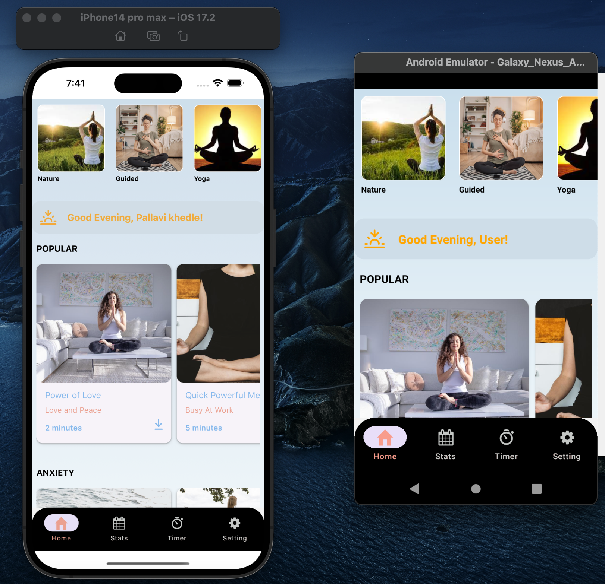
</div>
<div align="center">
  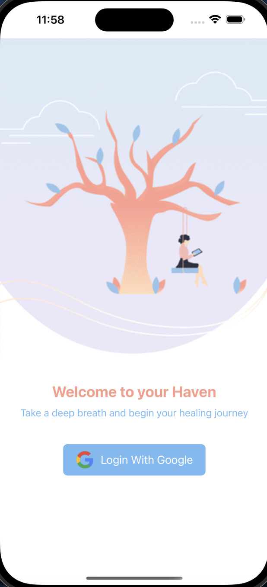
</div>
 
<div align='center'>
  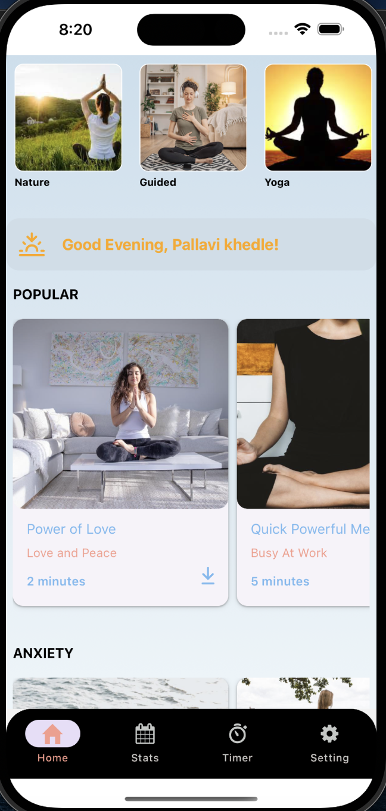
  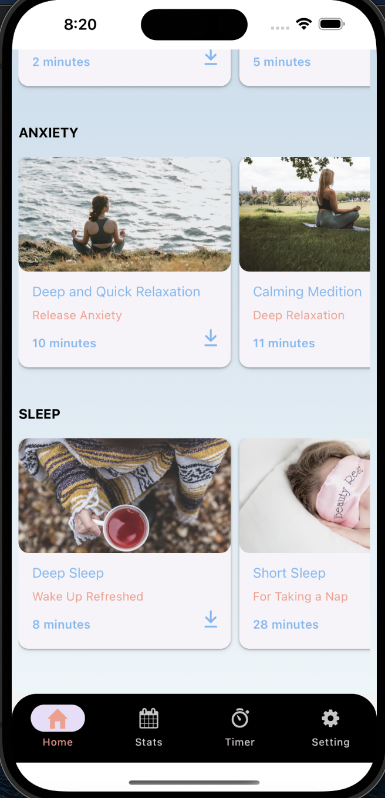
</div>

<div align='center'>
  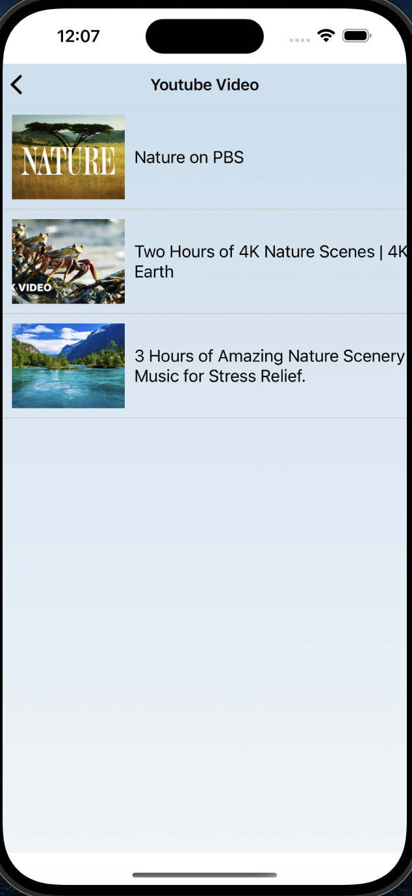
  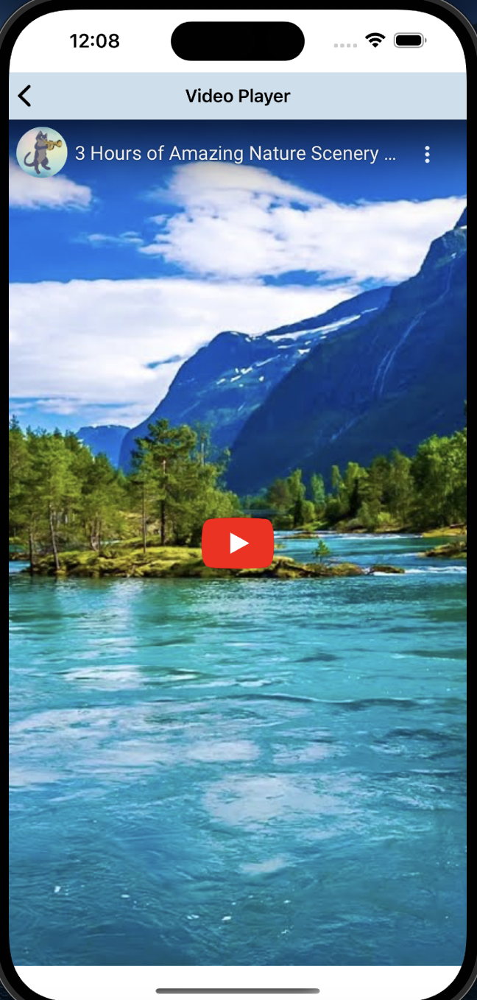
  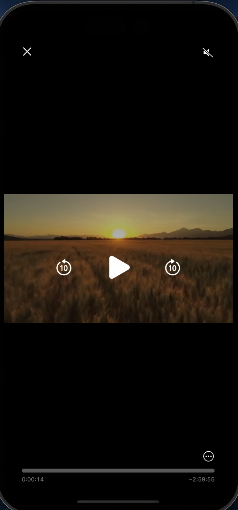
  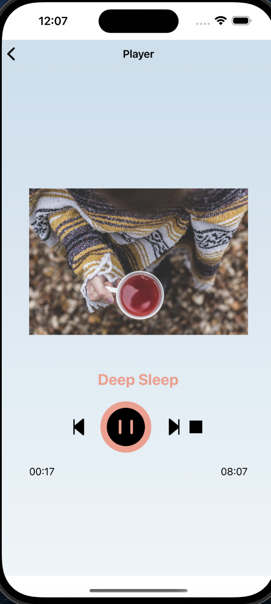
</div>


<div align='center'>
  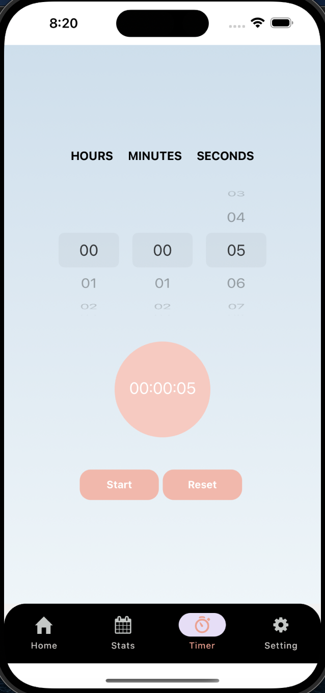
  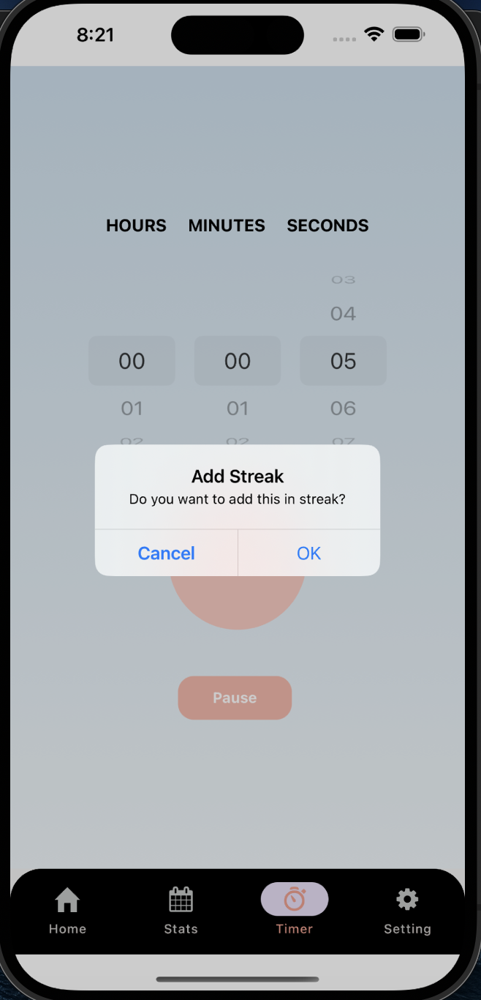
</div>

<div align='center'>
  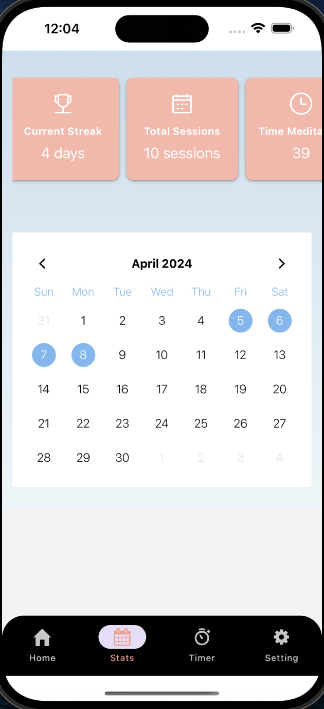
  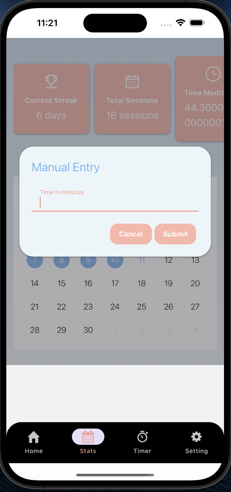
</div>
<div align='center'>
  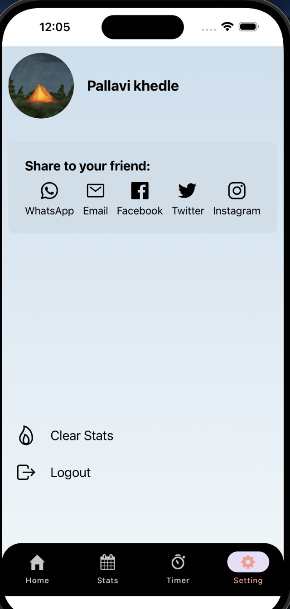
</div>


